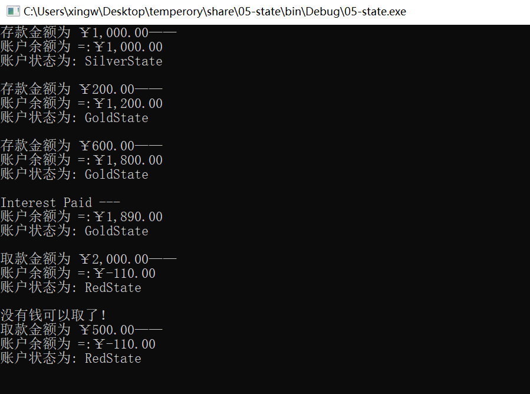

# 外观模式（Facade Pattern）

在软件开发过程中，客户端程序经常会与复杂系统的内部子系统进行耦合，从而导致客户端程序随着子系统的变化而变化，然而为了将复杂系统的内部子系统与客户端之间的依赖解耦，从而就有了外观模式，也称作 ”门面“模式。下面就具体介绍下外观模式

### 定义

外观模式提供了一个统一的接口，用来访问子系统中的一群接口。外观定义了一个高层接口，让子系统更容易使用。使用外观模式时，我们创建了一个统一的类，用来包装子系统中一个或多个复杂的类，客户端可以直接通过外观类来调用内部子系统中方法，从而外观模式让客户和子系统之间避免了紧耦合。

### 实现

下面与学校中一个选课系统为例来解释外观模式，例如在选课系统中，有注册课程子系统和通知子系统，在不使用外观模式的情况下，客户端必须同时保存注册课程子系统和通知子系统两个引用，如果后期这两个子系统发生改变时，此时客户端的调用代码也要随之改变，这样就没有很好的可扩展性

```c#
	/// <summary>
    /// 不使用外观模式的情况
    /// 此时客户端与三个子系统都发送了耦合，使得客户端程序依赖与子系统
    /// 为了解决这样的问题，我们可以使用外观模式来为所有子系统设计一个统一的接口
    /// 客户端只需要调用外观类中的方法就可以了，简化了客户端的操作
    /// 从而让客户和子系统之间避免了紧耦合
    /// </summary>
    class Client
    {
        static void Main(string[] args)
        {
            SubSystemA a = new SubSystemA();
            SubSystemB b = new SubSystemB();
            SubSystemC c = new SubSystemC();
            a.MethodA();
            b.MethodB();
            c.MethodC();
            Console.Read();
        }
    }

    // 子系统A
    public class SubSystemA
    {
        public void MethodA()
        {
            Console.WriteLine("执行子系统A中的方法A");
        }
    }

    // 子系统B
    public class SubSystemB
    {
        public void MethodB()
        {
            Console.WriteLine("执行子系统B中的方法B");
        }
    }

    // 子系统C
    public class SubSystemC
    {
        public void MethodC()
        {
            Console.WriteLine("执行子系统C中的方法C");
        }
    }
```

-

使用了外观模式之后，客户端只依赖与外观类，从而将客户端与子系统的依赖解耦了，如果子系统发生改变，此时客户端的代码并不需要去改变。**外观模式的实现核心主要是——由外观类去保存各个子系统的引用，实现由一个统一的外观类去包装多个子系统类，然而客户端只需要引用这个外观类，然后由外观类来调用各个子系统中的方法**。然而这样的实现方式非常类似适配器模式，然而外观模式与适配器模式不同的是：**适配器模式是将一个对象包装起来以改变其接口，而外观是将一群对象 ”包装“起来以简化其接口。**它们的意图是不一样的，适配器是将接口转换为不同接口，而外观模式是提供一个统一的接口来简化接口。

### 结构


然而对于外观模式而言，是没有一个一般化的类图描述，下面演示一个外观模式的示意性对象图来加深大家对外观模式的理解


在上面的对象图中有两个角色：

**门面（Facade）角色**：客户端调用这个角色的方法。该角色知道相关的一个或多个子系统的功能和责任，该角色会将从客户端发来的请求委派带相应的子系统中去。

**子系统（subsystem）角色**：可以同时包含一个或多个子系统。每个子系统都不是一个单独的类，而是一个类的集合。每个子系统都可以被客户端直接调用或被门面角色调用。对于子系统而言，门面仅仅是另外一个客户端，子系统并不知道门面的存在。

### 优缺点

**优点：**

1. 外观模式对客户屏蔽了子系统组件，从而简化了接口，减少了客户处理的对象数目并使子系统的使用更加简单。
2. 外观模式实现了子系统与客户之间的松耦合关系，而子系统内部的功能组件是紧耦合的。松耦合使得子系统的组件变化不会影响到它的客户。

**缺点：**

1. 如果增加新的子系统可能需要修改外观类或客户端的源代码，这样就违背了”开——闭原则“（不过这点也是不可避免）。

### 使用场景

在以下情况下可以考虑使用外观模式：

- 为一个复杂的子系统提供一个简单的接口
- 提供子系统的独立性
- 在层次化结构中，可以使用外观模式定义系统中每一层的入口。**其中三层架构就是这样的一个例子**。

### 总结

到这里外观模式的介绍就结束了，外观模式，为子系统的一组接口提供一个统一的接口，该模式定义了一个高层接口，这一个高层接口使的子系统更加容易使用。并且外观模式可以解决层结构分离、降低系统耦合度和为新旧系统交互提供接口功能。

# 模板方法模式（Template Method)

提到模板，大家肯定不免想到生活中的“简历模板”、“论文模板”、“Word中模版文件”等，在现实生活中，模板的概念就是——有一个规定的格式，然后每个人都可以根据自己的需求或情况去更新它，例如简历模板，下载下来的简历模板的格式都是相同的，然而我们下载下来简历模板之后我们可以根据自己的情况填充不同的内容要完成属于自己的简历。在设计模式中，模板方法模式中模板和生活中模板概念非常类似，下面让我们就详细介绍模板方法的定义，大家可以根据生活中模板的概念来理解模板方法的定义。

### 定义

模板方法模式——在一个抽象类中定义一个操作中的算法骨架（对应于生活中的大家下载的模板），而将一些步骤延迟到子类中去实现（对应于我们根据自己的情况向模板填充内容）。模板方法使得子类可以不改变一个算法的结构前提下，重新定义算法的某些特定步骤，模板方法模式把不变行为搬到超类中，从而去除了子类中的重复代码。

### 实现

下面以生活中炒蔬菜为例来实现下模板方法模式。在现实生活中，做蔬菜的步骤都大致相同，如果我们针对每种蔬菜类定义一个烧的方法，这样在每个类中都有很多相同的代码，为了解决这个问题，我们一般的思路肯定是把相同的部分抽象出来到抽象类中去定义，具体子类来实现具体的不同部分，这个思路也正式模板方法的实现精髓所在。

-

### 类图


模板方法模式中涉及了两个角色：

- **抽象模板角色（Vegetable扮演这个角色）**：定义了一个或多个抽象操作，以便让子类实现，这些抽象操作称为基本操作。
- **具体模板角色（Chinese Cabbage和Spinach扮演这个角色）**：实现父类所定义的一个或多个抽象方法。

### 优缺点

**优点：**

1. 实现了代码复用
2. 能够灵活应对子步骤的变化，符合开放-封闭原则

**缺点**：因为引入了一个抽象类，如果具体实现过多的话，需要用户或开发人员需要花更多的时间去理清类之间的关系。

在.NET中模板方法的应用也很多，例如我们在开发自定义控件时，我们只需要重写某个控件的部分方法。

### 总结

模板方法模式在抽象类中定义了算法的实现步骤，将这些步骤的实现延迟到具体子类中去实现，从而使所有子类复用了父类的代码，所以模板方法模式是基于继承的一种实现代码复用的技术。

# 观察者模式（Observer Pattern）

在现实生活中，处处可见观察者模式，例如，微信中的订阅号，订阅博客和微博中关注好友，这些都属于观察者模式的应用。

### 定义

　从生活中的例子可以看出，只要对订阅号进行关注的客户端，如果订阅号有什么更新，就会直接推送给订阅了的用户。从中，我们就可以得出观察者模式的定义。

　　观察者模式定义了一种一对多的依赖关系，让多个观察者对象同时监听某一个主题对象，这个主题对象在状态发生变化时，会通知所有观察者对象，使它们能够自动更新自己的行为。

### 结构

- 抽象主题角色（Subject）：抽象主题把所有观察者对象的引用保存在一个列表中，并提供增加和删除观察者对象的操作，抽象主题角色又叫做抽象被观察者角色，一般由抽象类或接口实现。
- 抽象观察者角色（Observer）：为所有具体观察者定义一个接口，在得到主题通知时更新自己，一般由抽象类或接口实现。
- 具体主题角色（Concrete Subject）：实现抽象主题接口，具体主题角色又叫做具体被观察者角色。
- 具体观察者角色（Concrete Observer）：实现抽象观察者角色所要求的接口，以便使自身状态与主题的状态相协调。

### 实现

```c#
// 腾讯游戏订阅号类
    public class TenxunGame
    {
        // 订阅者对象
        public Subscriber Subscriber {get;set;}

        public String Symbol {get; set;}

        public string Info {get ;set;}

        public void Update()
        {
            if (Subscriber != null)
            {
                // 调用订阅者对象来通知订阅者
                Subscriber.ReceiveAndPrintData(this);
            }
        }

    }

    // 订阅者类
    public class Subscriber
    {
        public string Name { get; set; }
        public Subscriber(string name)
        {
            this.Name = name;
        }

        public void ReceiveAndPrintData(TenxunGame txGame)
        {
            Console.WriteLine("Notified {0} of {1}'s" + " Info is: {2}", Name, txGame.Symbol, txGame.Info);
        }
    }

    // 客户端测试
    class Program
    {
        static void Main(string[] args)
        {
            // 实例化订阅者和订阅号对象
            Subscriber SubscriberSub = new Subscriber("Subscriber");
            TenxunGame txGame = new TenxunGame();
			//添加观察者
            txGame.Subscriber = SubscriberSub;
            txGame.Symbol = "TenXun Game";
            txGame.Info = "Have a new game published ....";

            txGame.Update();

            Console.ReadLine();
        }
    }
```

上面代码确实实现了监控订阅号的任务。但这里的实现存在下面几个问题：

- 订阅号类和订阅者类之间形成了一种双向依赖关系，即订阅号调用了订阅者的ReceiveAndPrintData方法，而订阅者调用了订阅号类的属性。这样的实现，如果有其中一个类变化将引起另一个类的改变。
- 当出现一个新的订阅者时，此时不得不修改订阅号代码，即添加另一个订阅者的引用和在Update方法中调用另一个订阅者的方法。

　　上面的设计违背了“开放——封闭”原则，显然，这不是我们想要的。**对此我们要做进一步的抽象，既然这里变化的部分是新订阅者的出现**，这样我们可以对订阅者抽象出一个接口，用它来取消订阅号类与具体的订阅者之间的依赖，做这样一步改进，确实可以解决订阅号类与具体订阅者之间的依赖，使其依赖与接口，从而形成弱引用关系，但还是不能解决出现一个订阅者不得不修改订阅号代码的问题。对此，我们可以做这样的思考——**订阅号存在多个订阅者，我们可以采用一个列表来保存所有的订阅者对象，在订阅号内部再添加对该列表的操作，这样不就解决了出现新订阅者的问题了嘛。并且订阅号也属于变化的部分，所以，我们可以采用相同的方式对订阅号进行抽象，抽象出一个抽象的订阅号类**，这样也就可以完美解决上面代码存在的问题了

-


从上图可以发现，这样的实现就是观察者模式的实现。这样，在任何时候，只要调用了订阅号类的Update方法，它就会通知所有的观察者对象，同时，可以看到，观察者模式，取消了直接依赖，变为间接依赖，这样大大提供了系统的可维护性和可扩展性。这里并不是直接给出观察者模式的实现，而是通过一步步重构的方式来引出观察者模式的实现。

### 使用场景

在下面的情况下可以考虑使用观察者模式：

- 当一个抽象模型有两个方面，其中一个方面依赖于另一个方面，将这两者封装在独立的对象中以使它们可以各自独立地改变和复用的情况下。
- 当对一个对象的改变需要同时改变其他对象，而又不知道具体有多少对象有待改变的情况下。
- 当一个对象必须通知其他对象，而又不能假定其他对象是谁的情况下。

### 优缺点

**优点：**

- 观察者模式实现了表示层和数据逻辑层的分离，并定义了稳定的更新消息传递机制，并抽象了更新接口，使得可以有各种各样不同的表示层，即观察者。
- 观察者模式在被观察者和观察者之间建立了一个抽象的耦合，被观察者并不知道任何一个具体的观察者，只是保存着抽象观察者的列表，每个具体观察者都符合一个抽象观察者的接口。
- 观察者模式支持广播通信。被观察者会向所有的注册过的观察者发出通知。

　**缺点**：

- 如果一个被观察者有很多直接和间接的观察者时，将所有的观察者都通知到会花费很多时间。
- 虽然观察者模式可以随时使观察者知道所观察的对象发送了变化，但是观察者模式没有相应的机制使观察者知道所观察的对象是怎样发生变化的。
- 如果在被观察者之间有循环依赖的话，被观察者会触发它们之间进行循环调用，导致系统崩溃，在使用观察者模式应特别注意这点。

### 总结

观察者模式定义了一种一对多的依赖关系，让多个观察者对象可以同时监听某一个主题对象，这个主题对象在发生状态变化时，会通知所有观察者对象，使它们能够自动更新自己，解决的是“当一个对象的改变需要同时改变多个其他对象”的问题。

# 中介者模式（Mediator Pattern）

### 定义

从生活中的例子可以看出，不论是在线游戏还是聊天群，它们都是充当一个中间平台，用户可以登录这个中间平台与其他用户进行交流，如果没有这些中间平台，我们如果想与朋友进行聊天的话，可能就需要当面才可以了。电话、短信也同样是一个中间平台，有了这个中间平台，每个用户都不要直接依赖与其他用户，只需要依赖这个中间平台就可以了，一切操作都由中间平台去分发。

中介者模式，定义了一个中介对象来封装一系列对象之间的交互关系。中介者使各个对象之间不需要显式地相互引用，从而使耦合性降低，而且可以独立地改变它们之间的交互行为。

### 结构

中介者模式设计两个具体对象，一个是用户类，另一个是中介者类，根据针对接口编程原则，则需要把这两类角色进行抽象，所以中介者模式中就有了4类角色，它们分别是：抽象中介者角色，具体中介者角色、抽象同事类和具体同事类。中介者类是起到协调各个对象的作用，则抽象中介者角色中则需要保存各个对象的引用。


在现实生活中，中介者的存在是不可缺少的，如果没有了中介者，我们就不能与远方的朋友进行交流了。而在软件设计领域，为什么要使用中介者模式呢？如果不使用中介者模式的话，各个同事对象将会相互进行引用，如果每个对象都与多个对象进行交互时，将会形成如下图所示的网状结构。


从上图可以发现，如果不使用中介者模式的话，每个对象之间过度耦合，这样的既不利于类的复用也不利于扩展。如果引入了中介者模式，那么对象之间的关系将变成星型结构，采用中介者模式之后会形成如下图所示的结构


### 实现

```c#
// 抽象牌友类
    public abstract class AbstractCardPartner
    {
        public int MoneyCount { get; set; }

        public AbstractCardPartner()
        {
            MoneyCount = 0;
        }

        public abstract void ChangeCount(int Count, AbstractCardPartner other);
    }

    // 牌友A类
    public class ParterA : AbstractCardPartner
    {
        public override void ChangeCount(int Count, AbstractCardPartner other)
        {
            this.MoneyCount += Count;
            other.MoneyCount -= Count;
        }
    }

    // 牌友B类
    public class ParterB : AbstractCardPartner
    {
        public override void ChangeCount(int Count, AbstractCardPartner other)
        {
            this.MoneyCount += Count;
            other.MoneyCount -= Count;
        }
    }

    class Program
    {
        // A,B两个人打牌
        static void Main(string[] args)
        {
            AbstractCardPartner A = new ParterA();
            A.MoneyCount = 20;
            AbstractCardPartner B = new ParterB();
            B.MoneyCount = 20;

            // A 赢了则B的钱就减少
            A.ChangeCount(5, B);
            Console.WriteLine("A 现在的钱是：{0}", A.MoneyCount);// 应该是25
            Console.WriteLine("B 现在的钱是：{0}", B.MoneyCount); // 应该是15

            // B赢了A的钱也减少
            B.ChangeCount(10, A);
            Console.WriteLine("A 现在的钱是：{0}", A.MoneyCount); // 应该是15
            Console.WriteLine("B 现在的钱是：{0}", B.MoneyCount); // 应该是25
            Console.Read();
        }
    }
```

上面确实完美解决了上面场景中的问题，并且使用了抽象类使具体牌友A和牌友B都依赖于抽象类，从而降低了同事类之间的耦合度。但是这样的设计，如果其中牌友A发生变化时，此时就会影响到牌友B的状态，如果涉及的对象变多的话，这时候某一个牌友的变化将会影响到其他所有相关联的牌友状态。例如牌友A算错了钱，这时候牌友A和牌友B的钱数都不正确了，如果是多个人打牌的话，影响的对象就会更多。

这时候就会思考——能不能把算钱的任务交给程序或者算数好的人去计算呢，这时候就有了我们QQ游戏中的欢乐斗地主等牌类游戏了。所以上面的设计，我们还是有进一步完善的方案的，即加入一个中介者对象来协调各个对象之间的关联。

```C#
namespace MediatorPattern
{
    // 抽象牌友类
    public abstract class AbstractCardPartner
    {
        public int MoneyCount { get; set; }

        public AbstractCardPartner()
        {
            MoneyCount = 0;
        }

        public abstract void ChangeCount(int Count, AbstractMediator mediator);
    }

    // 牌友A类
    public class ParterA : AbstractCardPartner
    {
        // 依赖与抽象中介者对象
        public override void ChangeCount(int Count, AbstractMediator mediator)
        {
            mediator.AWin(Count);
        }
    }

    // 牌友B类
    public class ParterB : AbstractCardPartner
    {
        // 依赖与抽象中介者对象
        public override void ChangeCount(int Count, AbstractMediator mediator)
        {
            mediator.BWin(Count);
        }
    }

    // 抽象中介者类
    public abstract class AbstractMediator
    {
        protected AbstractCardPartner A;
        protected AbstractCardPartner B;
        public AbstractMediator(AbstractCardPartner a, AbstractCardPartner b)
        {
            A = a;
            B = b;
        }

        public abstract void AWin(int count);
        public abstract void BWin(int count);
    }

    // 具体中介者类
    public class MediatorPater : AbstractMediator
    {
        public MediatorPater(AbstractCardPartner a, AbstractCardPartner b)
            : base(a, b)
        {
        }

        public override void AWin(int count)
        {
            A.MoneyCount += count;
            B.MoneyCount -= count;
        }

        public override void BWin(int count)
        {
            B.MoneyCount += count;
            A.MoneyCount -= count;
        }
    }

    class Program
    {
        static void Main(string[] args)
        {
            AbstractCardPartner A = new ParterA();
            AbstractCardPartner B = new ParterB();
            // 初始钱
            A.MoneyCount = 20;
            B.MoneyCount = 20;

            AbstractMediator mediator = new MediatorPater(A, B);

            // A赢了
            A.ChangeCount(5, mediator);
            Console.WriteLine("A 现在的钱是：{0}", A.MoneyCount);// 应该是25
            Console.WriteLine("B 现在的钱是：{0}", B.MoneyCount); // 应该是15

            // B 赢了
            B.ChangeCount(10, mediator);
            Console.WriteLine("A 现在的钱是：{0}", A.MoneyCount);// 应该是15
            Console.WriteLine("B 现在的钱是：{0}", B.MoneyCount); // 应该是25
            Console.Read();
        }
    }
}
```


### 适用场景

- 一组定义良好的对象，现在要进行复杂的相互通信。
- 想通过一个中间类来封装多个类中的行为，而又不想生成太多的子类。

### 优缺点

**优点：**

- 简化了对象之间的关系，将系统的各个对象之间的相互关系进行封装，将各个同事类解耦，使得系统变为松耦合。
- 提供系统的灵活性，使得各个同事对象独立而易于复用。

**缺点：**

- 中介者模式中，中介者角色承担了较多的责任，所以一旦这个中介者对象出现了问题，整个系统将会受到重大的影响。例如，QQ游戏中计算欢乐豆的程序出错了，这样会造成重大的影响。
- 新增加一个同事类时，不得不去修改抽象中介者类和具体中介者类，此时可以使用观察者模式和状态模式来解决这个问题。

### 总结

中介者模式，定义了一个中介对象来封装系列对象之间的交互。中介者使各个对象不需要显式地相互引用，从而使其耦合性降低，而且可以独立地改变它们之间的交互。中介者模式一般应用于一组定义良好的对象之间需要进行通信的场合以及想定制一个分布在多个类中的行为，而又不想生成太多的子类的情形下。

# 状态者模式（State Pattern）

### 介绍

每个对象都有其对应的状态，而每个状态又对应一些相应的行为，如果某个对象有多个状态时，那么就会对应很多的行为。那么对这些状态的判断和根据状态完成的行为，就会导致多重条件语句，并且如果添加一种新的状态时，需要更改之前现有的代码。这样的设计显然违背了开闭原则。状态模式正是用来解决这样的问题的。状态模式将每种状态对应的行为抽象出来成为单独新的对象，这样状态的变化不再依赖于对象内部的行为。

### 定义

状态模式——允许一个对象在其内部状态改变时自动改变其行为，对象看起来就像是改变了它的类。

### 结构

既然状态者模式是对已有对象的状态进行抽象，则自然就有抽象状态者类和具体状态者类，而原来已有对象需要保存抽象状态者类的引用，通过调用抽象状态者的行为来改变已有对象的行为。


从上图可知，状态者模式涉及以下三个角色：

- Account类：维护一个State类的一个实例，该实例标识着当前对象的状态。
- State类：抽象状态类，定义了一个具体状态类需要实现的行为约定。
- SilverState、GoldState和RedState类：具体状态类，实现抽象状态类的每个行为。

### 实现

下面，就以银行账户的状态来实现下状态者模式。银行账户根据余额可分为RedState、SilverState和GoldState。这些状态分别代表透支账号，新开账户和标准账户。账号余额在【-100.0，0.0】范围表示处于RedState状态，账号余额在【0.0 ， 1000.0】范围表示处于SilverState，账号在【1000.0， 100000.0】范围表示处于GoldState状态。下面以这样的一个场景实现下状态者模式，具体实现代码如下所示：

```c#
namespace StatePatternSample
{
    public class Account
    {
        public State State {get;set;}
        public string Owner { get; set; }
        public Account(string owner)
        {
            this.Owner = owner;
            this.State = new SilverState(0.0, this);
        }

        public double Balance { get {return State.Balance; }} // 余额
        // 存钱
        public void Deposit(double amount)
        {
            State.Deposit(amount);
            Console.WriteLine("存款金额为 {0:C}——", amount);
            Console.WriteLine("账户余额为 =:{0:C}", this.Balance);
            Console.WriteLine("账户状态为: {0}", this.State.GetType().Name);
            Console.WriteLine();
        }

        // 取钱
        public void Withdraw(double amount)
        {
            State.Withdraw(amount);
             Console.WriteLine("取款金额为 {0:C}——",amount);
            Console.WriteLine("账户余额为 =:{0:C}", this.Balance);
            Console.WriteLine("账户状态为: {0}", this.State.GetType().Name);
            Console.WriteLine();
        }

        // 获得利息
        public void PayInterest()
        {
            State.PayInterest();
            Console.WriteLine("Interest Paid --- ");
            Console.WriteLine("账户余额为 =:{0:C}", this.Balance);
            Console.WriteLine("账户状态为: {0}", this.State.GetType().Name);
            Console.WriteLine();
        }
    }

    // 抽象状态类
    public abstract class State
    {
        // Properties
        public Account Account { get; set; }
        public double Balance { get; set; } // 余额
        public double Interest { get; set; } // 利率
        public double LowerLimit { get; set; } // 下限
        public double UpperLimit { get; set; } // 上限

        public abstract void Deposit(double amount); // 存款
        public abstract void Withdraw(double amount); // 取钱
        public abstract void PayInterest(); // 获得的利息
    }

    // Red State意味着Account透支了
    public class RedState : State
    {
        public RedState(State state)
        {
            // Initialize
            this.Balance = state.Balance;
            this.Account = state.Account;
            Interest = 0.00;
            LowerLimit = -100.00;
            UpperLimit = 0.00;
        }

        // 存款
        public override void Deposit(double amount)
        {
            Balance += amount;
            StateChangeCheck();
        }
        // 取钱
        public override void Withdraw(double amount)
        {
            Console.WriteLine("没有钱可以取了！");
        }

        public override void PayInterest()
        {
            // 没有利息
        }

        private void StateChangeCheck()
        {
            if (Balance > UpperLimit)
            {
                Account.State = new SilverState(this);
            }
        }
    }

    // Silver State意味着没有利息得
    public class SilverState :State
    {
        public SilverState(State state)
            : this(state.Balance, state.Account)
        {
        }

        public SilverState(double balance, Account account)
        {
            this.Balance = balance;
            this.Account = account;
            Interest = 0.00;
            LowerLimit = 0.00;
            UpperLimit = 1000.00;
        }

        public override void Deposit(double amount)
        {
            Balance += amount;
            StateChangeCheck();
        }
        public override void Withdraw(double amount)
        {
            Balance -= amount;
            StateChangeCheck();
        }

        public override void PayInterest()
        {
            Balance += Interest * Balance;
            StateChangeCheck();
        }

        private void StateChangeCheck()
        {
            if (Balance < LowerLimit)
            {
                Account.State = new RedState(this);
            }
            else if (Balance > UpperLimit)
            {
                Account.State = new GoldState(this);
            }
        }
    }

    // Gold State意味着有利息状态
    public class GoldState : State
    {
        public GoldState(State state)
        {
            this.Balance = state.Balance;
            this.Account = state.Account;
            Interest = 0.05;
            LowerLimit = 1000.00;
            UpperLimit = 1000000.00;
        }
        // 存钱
        public override void Deposit(double amount)
        {
            Balance += amount;
            StateChangeCheck();
        }
        // 取钱
        public override void Withdraw(double amount)
        {
            Balance -= amount;
            StateChangeCheck();
        }
        public override void PayInterest()
        {
            Balance += Interest * Balance;
            StateChangeCheck();
        }

        private void StateChangeCheck()
        {
            if (Balance < 0.0)
            {
                Account.State = new RedState(this);
            }
            else if (Balance < LowerLimit)
            {
                Account.State = new SilverState(this);
            }
        }
    }

    class App
    {
        static void Main(string[] args)
        {
            // 开一个新的账户
            Account account = new Account("Learning Hard");

            // 进行交易
            // 存钱
            account.Deposit(1000.0);
            account.Deposit(200.0);
            account.Deposit(600.0);

            // 付利息
            account.PayInterest();

            // 取钱
            account.Withdraw(2000.00);
            account.Withdraw(500.00);

            // 等待用户输入
            Console.ReadKey();
        }
    }
}
```

上面代码的运行结果如下图所示



### 应用观察者模式和状态者模式完善中介者模式方案

```c#
// 抽象牌友类
    public abstract class AbstractCardPartner
    {
        public int MoneyCount { get; set; }

        public AbstractCardPartner()
        {
            MoneyCount = 0;
        }

        public abstract void ChangeCount(int Count, AbstractMediator mediator);
    }

    // 牌友A类
    public class ParterA : AbstractCardPartner
    {
        // 依赖与抽象中介者对象
        public override void ChangeCount(int Count, AbstractMediator mediator)
        {
            mediator.ChangeCount(Count);
        }
    }

    // 牌友B类
    public class ParterB : AbstractCardPartner
    {
        // 依赖与抽象中介者对象
        public override void ChangeCount(int Count, AbstractMediator mediator)
        {
            mediator.ChangeCount(Count);
        }
    }

    // 抽象状态类
    public abstract class State
    {
        protected AbstractMediator meditor;
        public abstract void ChangeCount(int count);
    }

    // A赢状态类
    public class AWinState : State
    {
        public AWinState(AbstractMediator concretemediator)
        {
            this.meditor = concretemediator;
        }

        public override void ChangeCount(int count)
        {
            foreach (AbstractCardPartner p in meditor.list)
            {
                ParterA a = p as ParterA;
                // 如果集合对象中是A对象，则对A的钱添加
                if (a != null)
                {
                    a.MoneyCount += count;
                }
                else
                {
                    p.MoneyCount -= count;
                }
            }
        }
    }

    // B赢状态类
    public class BWinState : State
    {
        public BWinState(AbstractMediator concretemediator)
        {
            this.meditor = concretemediator;
        }

        public override void ChangeCount(int count)
        {
            foreach (AbstractCardPartner p in meditor.list)
            {
                ParterB b = p as ParterB;
                // 如果集合对象中是B对象，则对B的钱添加
                if (b != null)
                {
                    b.MoneyCount += count;
                }
                else
                {
                    p.MoneyCount -= count;
                }
            }
        }
    }

    // 初始化状态类
    public class InitState : State
    {
        public InitState()
        {
            Console.WriteLine("游戏才刚刚开始,暂时还有玩家胜出");
        }

        public override void ChangeCount(int count)
        {
            //
            return;
        }
    }

    // 抽象中介者类
    public abstract class AbstractMediator
    {
        public List<AbstractCardPartner> list = new List<AbstractCardPartner>();

        public State State { get; set; }

        public AbstractMediator(State state)
        {
            this.State = state;
        }

        public void Enter(AbstractCardPartner partner)
        {
            list.Add(partner);
        }

        public void Exit(AbstractCardPartner partner)
        {
            list.Remove(partner);
        }

        public void ChangeCount(int count)
        {
            State.ChangeCount(count);
        }
    }

    // 具体中介者类
    public class MediatorPater : AbstractMediator
    {
        public MediatorPater(State initState)
            : base(initState)
        { }
    }

    class Program
    {
        static void Main(string[] args)
        {
            AbstractCardPartner A = new ParterA();
            AbstractCardPartner B = new ParterB();
            // 初始钱
            A.MoneyCount = 20;
            B.MoneyCount = 20;

            AbstractMediator mediator = new MediatorPater(new InitState());

            // A,B玩家进入平台进行游戏
            mediator.Enter(A);
            mediator.Enter(B);

            // A赢了
            mediator.State = new AWinState(mediator);
            mediator.ChangeCount(5);
            Console.WriteLine("A 现在的钱是：{0}", A.MoneyCount);// 应该是25
            Console.WriteLine("B 现在的钱是：{0}", B.MoneyCount); // 应该是15

            // B 赢了
            mediator.State = new BWinState(mediator);
            mediator.ChangeCount(10);
            Console.WriteLine("A 现在的钱是：{0}", A.MoneyCount);// 应该是25
            Console.WriteLine("B 现在的钱是：{0}", B.MoneyCount); // 应该是15
            Console.Read();
        }
    }
```

### 应用场景

- 当一个对象状态转换的条件表达式过于复杂时可以使用状态者模式。把状态的判断逻辑转移到表示不同状态的一系列类中，可以把复杂的判断逻辑简单化。
- 当一个对象行为取决于它的状态，并且它需要在运行时刻根据状态改变它的行为时，就可以考虑使用状态者模式。

### 优缺点

**优点**：

- 将状态判断逻辑每个状态类里面，可以简化判断的逻辑。
- 当有新的状态出现时，可以通过添加新的状态类来进行扩展，扩展性好。

**缺点**：

- 如果状态过多的话，会导致有非常多的状态类，加大了开销。

### 总结

状态者模式是对对象状态的抽象，从而把对象中对状态复杂的判断逻辑已到各个状态类里面，从而简化逻辑判断。