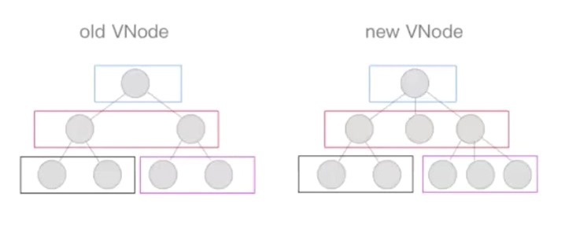

# 虚拟DOM

## 简介

对DOM的抽象，对象是JS对象

### 优点

1. 轻量，快速，因为是js，属性和数量比起真实DOM少，会尽可能少导致浏览器刷新，但是它的一些 DOM 操作的实现必须是普适的
2. 跨平台：虚拟 DOM 本质上是 JavaScript 对象,而 DOM 与平台强相关，相比之下虚拟 DOM 可以进行更方便地跨平台操作，例如服务器渲染等等
3. 在VUE上，对性能上的改进

##  更新

### 异步更新机制

```js
// Here we have async deferring wrappers using microtasks.
// In 2.5 we used (macro) tasks (in combination with microtasks).
// However, it has subtle problems when state is changed right before repaint
// (e.g. #6813, out-in transitions).
// Also, using (macro) tasks in event handler would cause some weird behaviors
// that cannot be circumvented (e.g. #7109, #7153, #7546, #7834, #8109).
// So we now use microtasks everywhere, again.
// A major drawback of this tradeoff is that there are some scenarios
// where microtasks have too high a priority and fire in between supposedly
// sequential events (e.g. #4521, #6690, which have workarounds)
// or even between bubbling of the same event (#6566).
let timerFunc
// The nextTick behavior leverages the microtask queue, which can be accessed
// via either native Promise.then or MutationObserver.
// MutationObserver has wider support, however it is seriously bugged in
// UIWebView in iOS >= 9.3.3 when triggered in touch event handlers. It
// completely stops working after triggering a few times... so, if native
// Promise is available, we will use it:
//VUE 首先尝试用微任务启动
/* istanbul ignore next, $flow-disable-line */
if (typeof Promise !== 'undefined' && isNative(Promise)) {
	const p = Promise.resolve()
	timerFunc = () => {
		p.then(flushCallbacks)
		// In problematic UIWebViews, Promise.then doesn't completely break, but
		// it can get stuck in a weird state where callbacks are pushed into the
		// microtask queue but the queue isn't being flushed, until the browser
		// needs to do some other work, e.g. handle a timer. Therefore we can
		// "force" the microtask queue to be flushed by adding an empty timer.
		if (isIOS) setTimeout(noop)
	}
	isUsingMicroTask = true
} else if (!isIE && typeof MutationObserver !== 'undefined' && (
		isNative(MutationObserver) ||
		// PhantomJS and iOS 7.x
		MutationObserver.toString() === '[object MutationObserverConstructor]'
	)) {
	// Use MutationObserver where native Promise is not available,
	// e.g. PhantomJS, iOS7, Android 4.4
	// (#6466 MutationObserver is unreliable in IE11)
	let counter = 1
	const observer = new MutationObserver(flushCallbacks)
	const textNode = document.createTextNode(String(counter))
	observer.observe(textNode, {
		characterData: true
	})
	timerFunc = () => {
		counter = (counter + 1) % 2
		textNode.data = String(counter)
	}
	isUsingMicroTask = true
} else if (typeof setImmediate !== 'undefined' && isNative(setImmediate)) {
	// Fallback to setImmediate.
	// Technically it leverages the (macro) task queue,
	// but it is still a better choice than setTimeout.
	timerFunc = () => {
		setImmediate(flushCallbacks)
	}
} else {
	// Fallback to setTimeout.
	timerFunc = () => {
		setTimeout(flushCallbacks, 0)
	}
}
```

https://jakearchibald.com/2015/tasks-microtasks-queues-and-schedules/

### patch

核心作用 vdom->dom，夹在js操作和真实dom的中间层

通过同层的树节点进行比较，而非对树进行逐层搜索遍历的方式，两棵树深度比较复杂度很高，将树的比较转为同层比较



同层级只做三件事：增删改。

```js
//patch.js 700
return function patch(oldVnode, vnode, hydrating, removeOnly, parentElm, refElm) {
	/*vnode不存在则删*/
	if (isUndef(vnode)) {
        //旧节点存在
		if (isDef(oldVnode)) invokeDestroyHook(oldVnode)
		return
	}
	let isInitialPatch = false
	const insertedVnodeQueue = []
	if (isUndef(oldVnode)) {
		/*oldVnode不存在  则创建新节点*/
		isInitialPatch = true
        //新增操作
		createElm(vnode, insertedVnodeQueue, parentElm, refElm)
	} else {
        // 传进来的可能是个真实DOM 初始化的情况向下会传入vm.$el --lifrcycle.js中的updata方法中
		/*oldVnode有nodeType，说明传递进来一个DOM元素*/
		const isRealElement = isDef(oldVnode.nodeType)
		if (!isRealElement && sameVnode(oldVnode, vnode)) {
			/*是虚拟DOM组件且是同一个节点的时候执行patch*/
			patchVnode(oldVnode, vnode, insertedVnodeQueue, removeOnly)
		} else {
			/*传递进来oldVnode是dom元素*/
			if (isRealElement) {
				// 将该dom元素清空
				oldVnode = emptyNodeAt(oldVnode)
			}
			/*取代现有元素：*/
			const oldElm = oldVnode.elm
			const parentElm = nodeOps.parentNode(oldElm)
			//创建一个新的dom
			createElm(
				vnode,
				insertedVnodeQueue,
				oldElm._leaveCb ? null : parentElm,
				nodeOps.nextSibling(oldElm)
			)
			if (isDef(parentElm)) {
				/*移除老节点*/
				removeVnodes(parentElm, [oldVnode], 0, 0)
			} else if (isDef(oldVnode.tag)) {
				/*调用destroy钩子*/
				invokeDestroyHook(oldVnode)
			}
		}
	}
	invokeInsertHook(vnode, insertedVnodeQueue, isInitialPatch)
	return vnode.elm
}

```


### patchVnode

两个VNode是相同节点，执行更新操作，包括三种类型操作：属性更新props、文本更新texxt、子节 点更新reorder

1. 如果新旧VNode都是静态的，不需比较。 
2.  新老节点均有children子节点，则比较chidren变化，调用updateChildren。 
3.  老节点没有子节点而新节点存在子节点，先清空老节点文本，然后为老节点加入子节点。 
4.  新节点没有子节点而老节点有子节点，移除该老节点的所有子节点。 
5. 当新老节点都无子节点的时候，只是文本的替换。

```js
//patch.js 500
/*patch VNode节点*/
function patchVnode(oldVnode, vnode, insertedVnodeQueue,ownerArray, index, removeOnly) {
     if (oldVnode === vnode) {
      return
    }
	const elm = vnode.elm = oldVnode.elm
	/*	静态节点等不需比较的情况
		静态节点不会发生变化*/
	if (isTrue(vnode.isStatic) &&
		isTrue(oldVnode.isStatic) &&
		vnode.key === oldVnode.key &&
		(isTrue(vnode.isCloned) || isTrue(vnode.isOnce))) {
		vnode.elm = oldVnode.elm
		vnode.componentInstance = oldVnode.componentInstance
		return
	}
	const oldCh = oldVnode.children
	const ch = vnode.children
	/*执行属性、事件、样式等等更新操作*/
	if (isDef(data) && isPatchable(vnode)) {
		for (i = 0; i < cbs.update.length; ++i) cbs.update[i](oldVnode, vnode)
		if (isDef(i = data.hook) && isDef(i = i.update)) i(oldVnode, vnode)
	}
	/*开始判断children的各种情况*/
	/*如果这个VNode节点没有text文本时 表示该节点有children*/
	if (isUndef(vnode.text)) {
		if (isDef(oldCh) && isDef(ch)) {
			/*新老节点均有children子节点，则对子节点进行diff操作，调用updateChildren*/
			if (oldCh !== ch) updateChildren(elm, oldCh, ch, insertedVnodeQueue,removeOnly)
		} else if (isDef(ch)) {
            //
			/*如果老节点没有子节点而新节点存在子节点，先清空elm的文本内容，然后为当前节点加入子节
			点*/
			if (isDef(oldVnode.text)) nodeOps.setTextContent(elm, '')
			addVnodes(elm, null, ch, 0, ch.length - 1, insertedVnodeQueue)
		} else if (isDef(oldCh)) {
			/*当新节点没有子节点而老节点有子节点的时候，则移除所有ele的子节点*/
			removeVnodes(elm, oldCh, 0, oldCh.length - 1)
		} else if (isDef(oldVnode.text)) {
			/*老节点有文本，新节点text不存在，清除文本即可*/
			nodeOps.setTextContent(elm, '')
		}
	} else if (oldVnode.text !== vnode.text) {
		/*当新老节点text不一样时，直接替换这段文本*/
		nodeOps.setTextContent(elm, vnode.text)
	}
}

```

```vue
{
	text: 'foo',
	children: []
}
//重点：text 和 children 不会同时存在
//情况1   只用text描述
<p>123123</p>  <p>{{}}</p>
//情况2	只用children描述
<p>abc<span>san</span></p>
```


##### updateChildren

通常较为常见的push pop shift unshift reserve，从中间删除或者插入并不多见

时间复杂度最快O(n)

作用是比对新旧两个VNode的children的差异并更新。vue中针对web场景特点做了特别的算法优化：

在新老两组VNode节点的头尾两侧添加游标，**在遍历过程中这几个游标都会向中间靠拢**。当 **oldStartIdx > oldEndIdx**或者**newStartIdx > newEndIdx**时结束循环。


遍历规则： 

oldStartVnode、oldEndVnode与newStartVnode、newEndVnode两两**交叉比较**，共有4种比较方法。

 当 oldStartVnode和newStartVnode 或者 oldEndVnode和newEndVnode是相同节点，直接patch两者。


如果oldStartVnode与newEndVnode相同，patch两者并移动oldStartVnode到oldEndVnode的后面


如果oldEndVnode与newStartVnode相同，patch两者并移动oldEndVnode到oldStartVnode前面


如果以上情况均不符合，则在old VNode中找与newStartVnode相同点，若存在则patch两者并将 elmToMove移动到oldStartVnode前面。


若在old VNode中找不到一致节点，则创建一个新的节点放oldStartVnode前面


循环结束，还需要处理剩下的节点：当**oldStartIdx > oldEndIdx**，这时old VNode已经遍历完，new VNode还没有，剩下的VNode都是新增节点，批量创建并插入到oldEndIdx后面。


当**newStartIdx > newEndIdx**时，说明new VNode已经遍历完，old VNode还有剩余，把剩余节点删除 即可。


```js
//patch.js 404
function updateChildren(parentElm, oldCh, newCh, insertedVnodeQueue, removeOnly) {
	let oldStartIdx = 0
	let newStartIdx = 0
	let oldEndIdx = oldCh.length - 1
	let oldStartVnode = oldCh[0]
	let oldEndVnode = oldCh[oldEndIdx]
	let newEndIdx = newCh.length - 1
	let newStartVnode = newCh[0]
	let newEndVnode = newCh[newEndIdx]
	let oldKeyToIdx, idxInOld, elmToMove, refElm
	// 确保移除元素在过度动画过程中待在正确的相对位置，仅用于<transition-group>
	const canMove = !removeOnly
	// 循环条件：任意起始索引超过结束索引就结束
	while (oldStartIdx <= oldEndIdx && newStartIdx <= newEndIdx) {
		if (isUndef(oldStartVnode)) {
			oldStartVnode = oldCh[++oldStartIdx] // Vnode has been moved left
		} else if (isUndef(oldEndVnode)) {
			oldEndVnode = oldCh[--oldEndIdx]
		} else if (sameVnode(oldStartVnode, newStartVnode)) {
			/*分别比较oldCh以及newCh的两头节点4种情况，判定为同一个VNode，则直接patchVnode即
			可*/
			patchVnode(oldStartVnode, newStartVnode, insertedVnodeQueue)
			oldStartVnode = oldCh[++oldStartIdx]
			newStartVnode = newCh[++newStartIdx]
		} else if (sameVnode(oldEndVnode, newEndVnode)) {
			patchVnode(oldEndVnode, newEndVnode, insertedVnodeQueue)
			oldEndVnode = oldCh[--oldEndIdx]
			newEndVnode = newCh[--newEndIdx]
		} else if (sameVnode(oldStartVnode, newEndVnode)) { // Vnode moved right
			patchVnode(oldStartVnode, newEndVnode, insertedVnodeQueue)
			canMove && nodeOps.insertBefore(parentElm, oldStartVnode.elm,
				nodeOps.nextSibling(oldEndVnode.elm))
			oldStartVnode = oldCh[++oldStartIdx]
			newEndVnode = newCh[--newEndIdx]
		} else if (sameVnode(oldEndVnode, newStartVnode)) { // Vnode moved left
			patchVnode(oldEndVnode, newStartVnode, insertedVnodeQueue)
			canMove && nodeOps.insertBefore(parentElm, oldEndVnode.elm, oldStartVnode.elm)
			oldEndVnode = oldCh[--oldEndIdx]
			newStartVnode = newCh[++newStartIdx]
		} else {
			/*
			生成一个哈希表，key是旧VNode的key，值是该VNode在旧VNode中索引
			*/
			if (isUndef(oldKeyToIdx)) oldKeyToIdx =
				createKeyToOldIdx(oldCh, oldStartIdx, oldEndIdx)
			/*如果newStartVnode存在key并且这个key在oldVnode中能找到则返回这个节点的索引*/
			idxInOld = isDef(newStartVnode.key) ? oldKeyToIdx[newStartVnode.key] : null
			if (isUndef(idxInOld)) {
				/*没有key或者是该key没有在老节点中找到则创建一个新的节点*/
				createElm(newStartVnode, insertedVnodeQueue, parentElm, oldStartVnode.elm)
				newStartVnode = newCh[++newStartIdx]
			} else {
				/*获取同key的老节点*/
				elmToMove = oldCh[idxInOld]
				if (sameVnode(elmToMove, newStartVnode)) {
					/*如果新VNode与得到的有相同key的节点是同一个VNode则进行patchVnode*/
					patchVnode(elmToMove, newStartVnode, insertedVnodeQueue)
					/*因为已经patchVnode进去了，所以将这个老节点赋值undefined，之后如果还有新节点
					与该节点key相同可以检测出来提示已有重复的key*/
					oldCh[idxInOld] = undefined
					/*当有标识位canMove实可以直接插入oldStartVnode对应的真实DOM节点前面*/
					canMove && nodeOps.insertBefore(parentElm, newStartVnode.elm,oldStartVnode.elm)
					newStartVnode = newCh[++newStartIdx]
				} else {
					/*当新的VNode与找到的同样key的VNode不是sameVNode的时候（比如说tag不一样或者
					是有不一样type的input标签），创建一个新的节点*/
					createElm(newStartVnode, insertedVnodeQueue, parentElm, oldStartVnode.elm)
					newStartVnode = newCh[++newStartIdx]
				}
			}
		}
	}
	if (oldStartIdx > oldEndIdx) {
		/*全部比较完成以后，发现oldStartIdx > oldEndIdx的话，说明老节点已经遍历完了，新节点
		比老节点多，所以这时候多出来的新节点需要一个一个创建出来加入到真实DOM中*/
		refElm = isUndef(newCh[newEndIdx + 1]) ? null : newCh[newEndIdx + 1].elm
		addVnodes(parentElm, refElm, newCh, newStartIdx, newEndIdx, insertedVnodeQueue)
	} else if (newStartIdx > newEndIdx) {
		/*如果全部比较完成以后发现newStartIdx > newEndIdx，则说明新节点已经遍历完了，老节点
		多余新节点，这个时候需要将多余的老节点从真实DOM中移除*/
		removeVnodes(parentElm, oldCh, oldStartIdx, oldEndIdx)
	}
}

```


